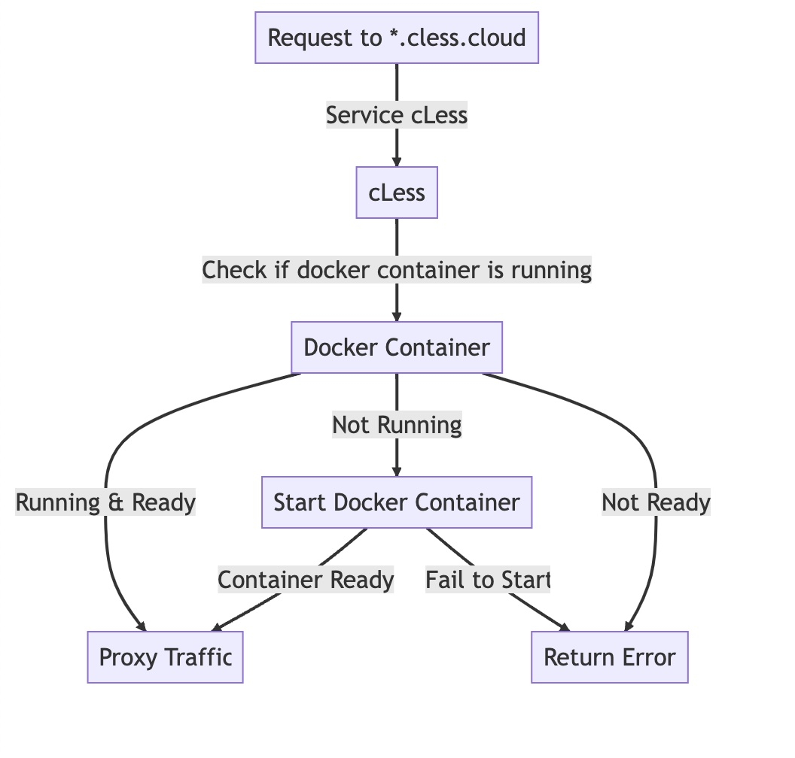

# cLess

# in this part we will add an admin service to cless:
- admin service will be a go service
- admin service will be be able to manage service definitions (list, get, create, etc)
- `serviceDefinition` will document the service name, image name, image tag, port, etc
- mapping of host to container will be based on `serviceDefinition.Name`
- code will be modular and easy to extend for next parts

# build images locally so they are available for docker
```bash
cd .. && ./build_images.sh
```

## Setup 
add this to /etc/hosts
```
127.0.0.1       golang.cless.cloud
127.0.0.1       python.cless.cloud
127.0.0.1       java.cless.cloud
127.0.0.1       nodejs.cless.cloud
127.0.0.1       rust.cless.cloud
127.0.0.1       admin.cless.cloud
```

## Run Server
```bash
go run build && ./cless
```

## register services examples

```bash
curl -X POST -H "Content-Type: application/json" \
 -d '{"name":"rust", "image_name":"rust-docker", "image_tag": "latest", "port":8080}' \
 http://admin.cless.cloud/serviceDefinitions

 curl -X POST -H "Content-Type: application/json" \
 -d '{"name":"java", "image_name":"java-docker", "image_tag": "latest", "port":8080}' \
 http://admin.cless.cloud/serviceDefinitions
```

## Test or Browse
```bash
curl http://rust.cless.cloud/
curl http://java.cless.cloud/
```

## architecture

