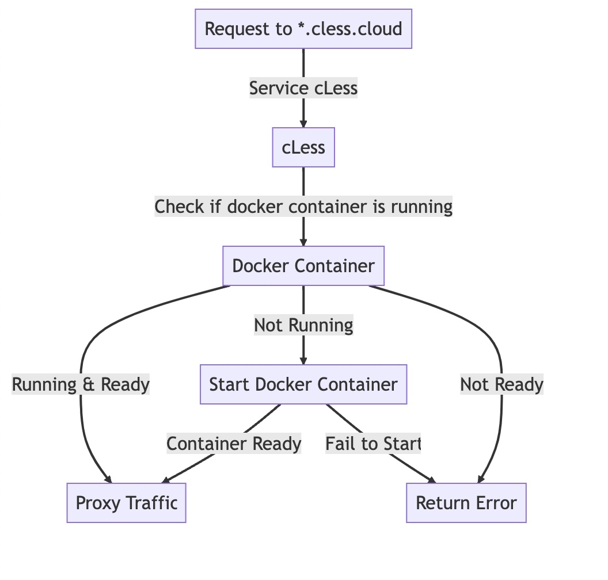

# cLess

# in this part we will:
- Support of versioning
- Version Promotion (Canary, A/B & more)
- Environment variables
- Garbage collection of idle containers

# build images locally so they are available for docker
```bash
cd .. && ./build_images.sh
```

## Setup 
add this to /etc/hosts
```
127.0.0.1       admin.cless.cloud
127.0.0.1  app-0.cless.cloud,app-1.cless.cloud,app-2.cless.cloud,app-3.cless.cloud,app-4.cless.cloud,app-5.cless.cloud,app-6.cless.cloud,app-7.cless.cloud,app-8.cless.cloud,app-9.cless.cloud,app-10.cless.cloud,app-11.cless.cloud,app-12.cless.cloud,app-13.cless.cloud,app-14.cless.cloud,app-15.cless.cloud,app-16.cless.cloud,app-17.cless.cloud,app-18.cless.cloud,app-19.cless.cloud,app-20.cless.cloud,app-21.cless.cloud,app-22.cless.cloud,app-23.cless.cloud,app-24.cless.cloud,app-25.cless.cloud,app-26.cless.cloud,app-27.cless.cloud,app-28.cless.cloud,app-29.cless.cloud,app-30.cless.cloud,app-31.cless.cloud,app-32.cless.cloud,app-33.cless.cloud,app-34.cless.cloud,app-35.cless.cloud,app-36.cless.cloud,app-37.cless.cloud,app-38.cless.cloud,app-39.cless.cloud,app-40.cless.cloud,app-41.cless.cloud,app-42.cless.cloud,app-43.cless.cloud,app-44.cless.cloud,app-45.cless.cloud,app-46.cless.cloud,app-47.cless.cloud,app-48.cless.cloud,app-49.cless.cloud,app-50.cless.cloud,app-51.cless.cloud,app-52.cless.cloud,app-53.cless.cloud,app-54.cless.cloud,app-55.cless.cloud,app-56.cless.cloud,app-57.cless.cloud,app-58.cless.cloud,app-59.cless.cloud,app-60.cless.cloud,app-61.cless.cloud,app-62.cless.cloud,app-63.cless.cloud,app-64.cless.cloud,app-65.cless.cloud,app-66.cless.cloud,app-67.cless.cloud,app-68.cless.cloud,app-69.cless.cloud,app-70.cless.cloud,app-71.cless.cloud,app-72.cless.cloud,app-73.cless.cloud,app-74.cless.cloud,app-75.cless.cloud,app-76.cless.cloud,app-77.cless.cloud,app-78.cless.cloud,app-79.cless.cloud,app-80.cless.cloud,app-81.cless.cloud,app-82.cless.cloud,app-83.cless.cloud,app-84.cless.cloud,app-85.cless.cloud,app-86.cless.cloud,app-87.cless.cloud,app-88.cless.cloud,app-89.cless.cloud,app-90.cless.cloud,app-91.cless.cloud,app-92.cless.cloud,app-93.cless.cloud,app-94.cless.cloud,app-95.cless.cloud,app-96.cless.cloud,app-97.cless.cloud,app-98.cless.cloud,app-99.cless.cloud,app-100.cless.cloud
```

## symlinking docker socket in case it doesn't exist
```bash
# check if /var/run/docker.sock exists, if it is don't do anything
ls /var/run/docker.sock || sudo ln -s ~/.docker/run/docker.sock /var/run/docker.sock
```

## Run Server
```bash
go run build && ./cless
```

## register services examples

```bash
curl -X POST -H "Content-Type: application/json" \
 -d '{"name":"my-python-app"}' \
 http://admin.cless.cloud/serviceDefinitions
```


## Add versions

```bash
curl -X POST -H "Content-Type: application/json" \
 -d '{"image_name":"python-docker", "image_tag":"latest", "port":8080, "env_vars":["GREETING=Go"]}' \
 http://admin.cless.cloud/serviceDefinitions/my-python-app/versions

 curl -X POST -H "Content-Type: application/json" \
 -d '{"image_name":"python-docker", "image_tag":"latest", "port":8080, "env_vars":["GREETING=Docker"]}' \
 http://admin.cless.cloud/serviceDefinitions/my-python-app/versions


 curl -X POST -H "Content-Type: application/json" \
 -d '{"image_name":"python-docker", "image_tag":"latest", "port":8080, "env_vars":["GREETING=sqlite"]}' \
 http://admin.cless.cloud/serviceDefinitions/my-python-app/versions
```

### Get versions
```bash
curl -s http://admin.cless.cloud/serviceDefinitions/my-python-app/versions | jq '.[].ID'
6
7
8
```

### Traffic Distribution
```bash
curl -X POST -H "Content-Type: application/json" \
 -d '{"weights":[{"service_version_id":6, "weight": 10}, {"service_version_id":7, "weight": 30}, {"service_version_id":8, "weight": 60}]}' \
 http://admin.cless.cloud/serviceDefinitions/my-python-app/trafficWeights

```

### get hostname
```bash
curl http://admin.cless.cloud/serviceDefinitions/my-python-app | jq -r '.host'
app-51.cless.cloud
```

### Test Distribution
```bash
for i in {1..100}; do curl -s app-51.cless.cloud >> data.txt; echo "" >> data.txt; done

cat data.txt | sort | uniq -c
36 Hello, Docker!
8 Hello, Go!
56 Hello, sqlite!

```


## architecture

